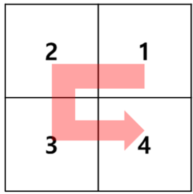
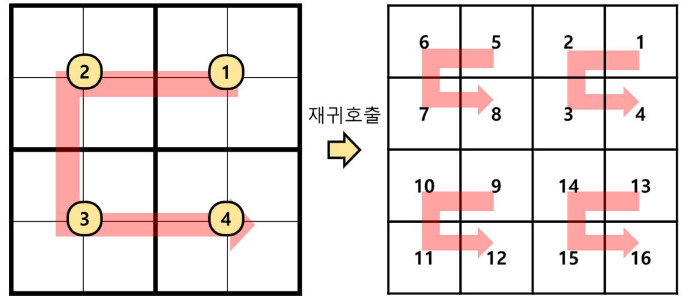

## 문제
담디는 디귿(ㄷ)자 모양이 너무나도 좋아서, 2차원 배열에 숫자를 디귿자로 배치하려고 한다.

깔끔한 것을 좋아하는 담디는 정방형(높이와 너비가 같은) 2차원 배열만을 사용한다.

숫자를 채우는 구체적인 방법은 아래와 같다.

- 배열의 높이와 너비는 ```n```으로 같으며, 항상 2의 제곱수이다.
- 배열을 높이와 너비를 반반씩 나누어 4개의 부분 배열을 만든다.
  - 우측 상단, 좌측 상단, 좌측 하단, 우측 하단의 순서로 숫자를 채운다. (ㄷ자를 한 붓 그리기 한 순서)
  - 각 부분 배열을 채우는 방법은 이 방법을 재귀적으로 사용하여 숫자를 채운다.
즉, 예를 들면 ```n=2```인 경우에는 아래와 같이 디귿자 모양으로 곧바로 숫자를 채운다.



```n=4```인 경우에는 아래와 같이 재귀적으로 순서를 정해서 숫자를 채운다.



이 때, ```i```행 ```j```열에 위치한 값을 반환하는 프로그램을 작성하시오. 
(행과 열은 ```0```부터 시작해서 ```n-1```까지의 값을 가진다.)

## 입력설명
- ```2 <= n <= 512```
- ```0 <= i < n```
- ```0 <= j < n```

## 출력설명
- ```n```x```n``` 배열에서 ```(i, j)```에 위치한 값을 정수로 반환

## 매개변수 형식
- ```n = 4```
- ```i = 1```
- ```j = 3```

## 반환값 형식
- ```4```

## 예시 입출력 설명
- 위의 ```n=4```인 경우에서 (1, 3) 위치의 값인 4를 반환