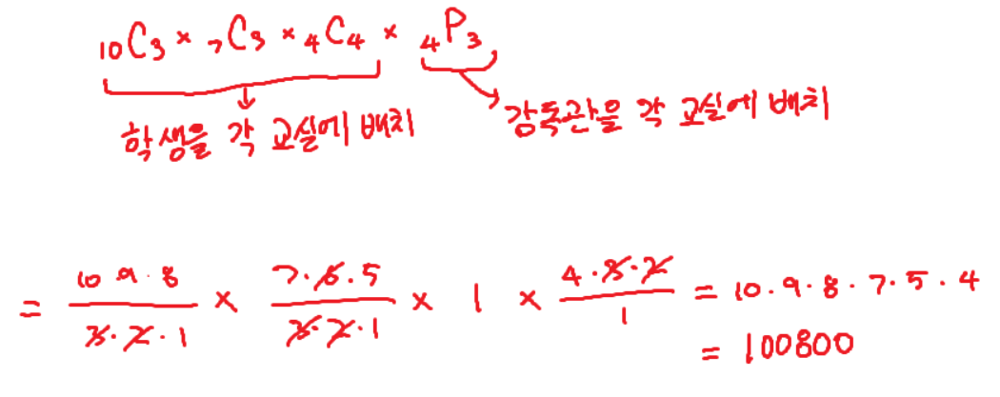

## 문제
제로베이스에서는 우수한 수강생들과 즐거운 시간을 보내기 위해, 한 주간 배운 내용으로 시험을 보기로 했다.

즐겁게 시험에 응시하는 학생은 총 ```N```명으로, 수강생 모두가 성취도를 파악하고자 참가하기로 했다.

시험을 보기 위해서는 ```M```개의 교실에 모든 학생과, 감독관을 한 명씩 배치해야 한다.

교실에 학생이 배치되지 않을 수도 있으며, 교실이 비어있더라도 감독관은 배치해야 한다.

각 교실에 수용 가능한 최대 인원은 ```capacity``` 배열에 저장되어 있다. 
즉, ```i```번째 교실에 수용 가능한 최대 인원은 ```capacity[i]```이다.

모든 교실에 수용 가능한 최대 인원의 총 합은 수강생의 수보다 항상 많거나 같다. 
즉, ```capacity``` 배열에 담긴 모든 수의 합은 ```N```보다 크거나 같다.

감독관은 총 ```K```명이 있으며, 감독관의 수가 부족한 일은 없다. 
즉, 항상 ```M <= K```이다.

이 때, 학생과 감독관을 교실에 배정하는 모든 경우의 수를 구하시오.

## 입력설명
- ```0 < N <= 30```
- ```0 < M <= 3```
- ```0 < K <= 10```
- ```0 < capacity[i] <= 10```
- ```capacity.length = M```

## 출력설명
- 경우의 수를 정수로 반환

## 매개변수 형식
- ```N = 10```
- ```M = 3```
- ```K = 4```
- ```capacity = {3, 3, 4}```

## 반환값 형식
- ```100800```

## 예시 입출력 설명
- 학생을 각 교실에 배치하는 경우의 수와, 감독관을 각 교실에 배치하는 경우의 수를 이용해 계산하면 아래와 같이 계산된다.



단, 예시의 경우 총 학생의 수와 수용 가능한 학생의 수가 같은 특별한 경우인 점을 고려하여 문제를 해결하시오.