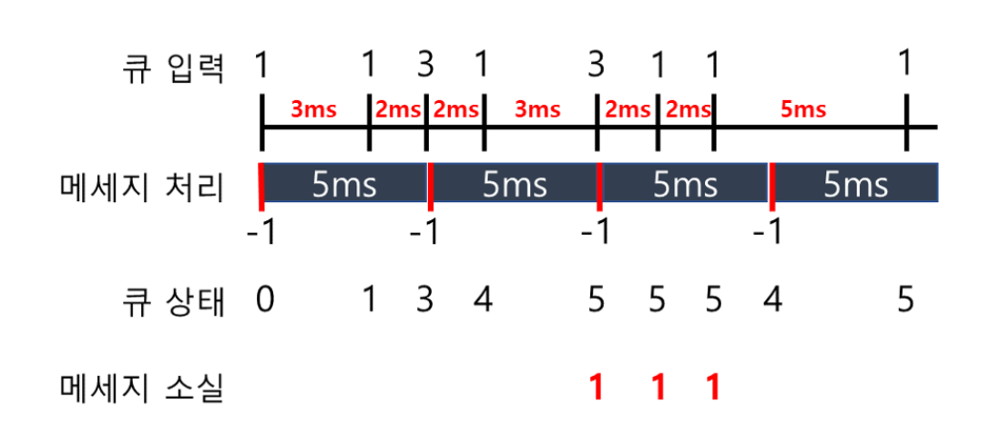

## 문제
복만이는 메신저 서비스를 운영하고 있다. 
복만이는 새 해 첫 날이 다가오면 급증하는 서비스 사용량에 골머리를 앓고 있다.

복만이의 메신저 서버는 큐를 이용해 메세지를 전달받아 처리하며, 
하나의 메세지를 처리하는 데에 `delay` ms의 시간이 소요된다.

새해가 바뀌는 순간에는 너무나 많은 메세지가 오가기 때문에, 
지정된 큐의 용량인 `capacity`를 넘어서는 일이 생기곤 한다.

메세지는 처리하기 시작하는 순간 큐에서 제거되며, 
큐의 용량이 가득 찬 상태에서 입력된 메세지는 소실된다.

또한, 큐에 입력과 제거가 동시에 이루어지는 경우, 제거가 먼저 이루어진다.

서버의 큐에 이전 메세지가 전달된 후, 
다음 메세지가 전달될 때 까지 소요된 시간(ms)을 모아 `times` 배열에 모았을 때,

소실되어 전달되지 못한 메세지의 개수를 출력하시오.

## 입력설명
- `0 < delay <= 10`
- `0 < capacity <= 1000`
- `0 < times.length <= 100000`
- `0 <= times[i] <= 10000`

## 출력설명
- 소실된 메세지의 개수를 정수로 반환

## 매개변수 형식
- `delay = 5`
- `capacity = 5`
- `times = {3, 2, 0, 0, 2, 3, 0, 0, 2, 2, 5}`

## 반환값 형식
- `3`

예시 입출력 설명
아래 그림과 같이 `10`ms, `12`ms, `14`ms 구간에서 각각 메세지 소실이 하나씩 발생한다.

