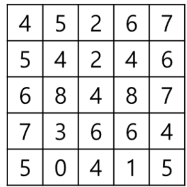
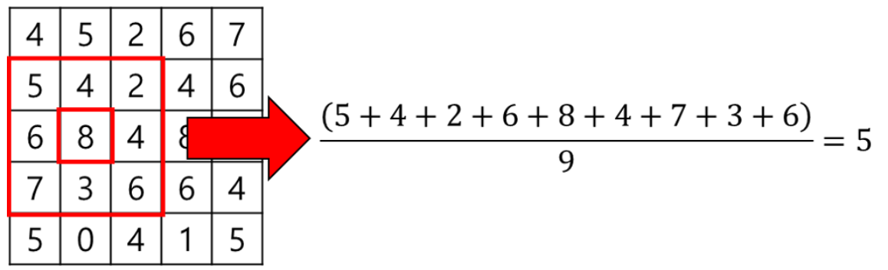
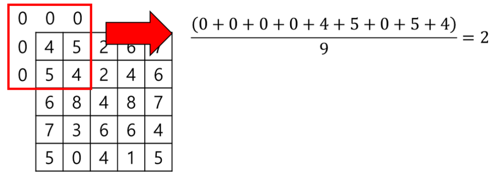

## 문제
레나는 영상처리의 기초적인 계산 중 하나인 주변 평균을 구현하려고 한다.

주변 평균은 주변 `K`x`K` 픽셀값의 평균을 구해 픽셀 값을 대체하는 영상처리 기법이다.

예를 들면, 아래와 같은 2-D 배열로 표현된 이미지가 있다고 하자.

이 때, `(2, 1)` 위치에서 `K=3`인 주변 평균은 아래와 같이 구할 수 있다.

단, `(0, 0)` 위치처럼 주변 값이 부족한 경우에는 아래와 같이 가상의 `0`이 있다고 생각하여 계산한다.

이 규칙을 따라 모든 픽셀을 계산하면 주변 평균 이미지를 구할 수 있다.

주어진 2-D 배열 입력 `image`에 대해, `K`x`K` 주변 평균 이미지를 2-D 배열로 출력하시오. (단, 평균값은 내림하여 정수로 구하시오.)

## 입력설명
- `0 < image.length <= 256`
- `0 < image[i].length <= 256`
- `3 <= K <= 201`
- `K` 값은 항상 홀수

## 출력설명
- 평균 이미지로 구성된 2-D 배열 출력

## 매개변수 형식
    image = {{4, 5, 2, 6, 7},
    {5, 4, 2, 4, 6},
    {6, 8, 4, 8, 7},
    {7, 3, 6, 6, 4},
    {5, 0, 4, 1, 5}}
- `K = 3`

## 반환값 형식
    {{2, 2, 2, 3, 2},
    {3, 4, 4, 5, 4},
    {3, 5, 5, 5, 3},
    {3, 4, 4, 5, 3},
    {1, 2, 2, 2, 1}}